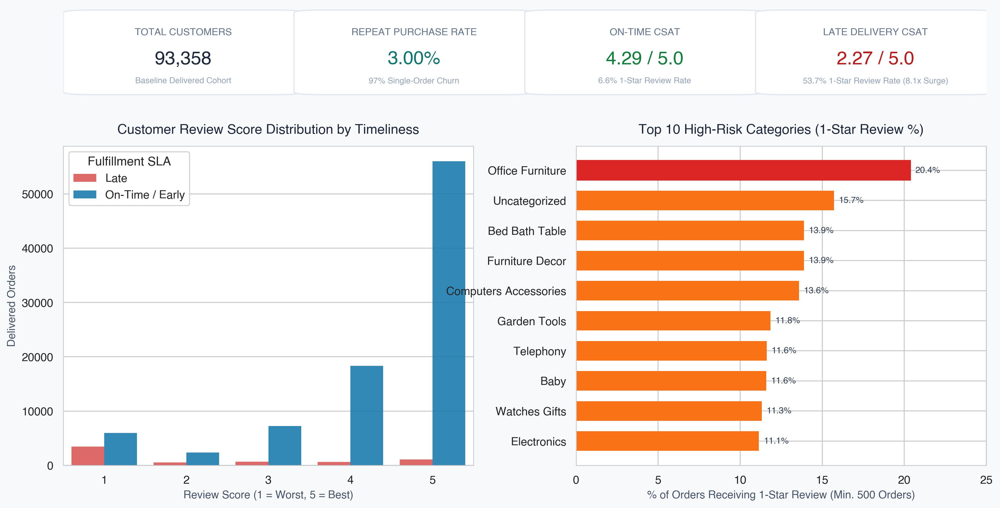
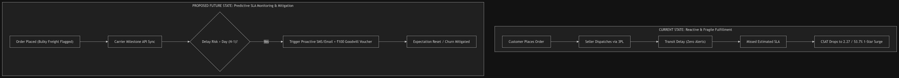
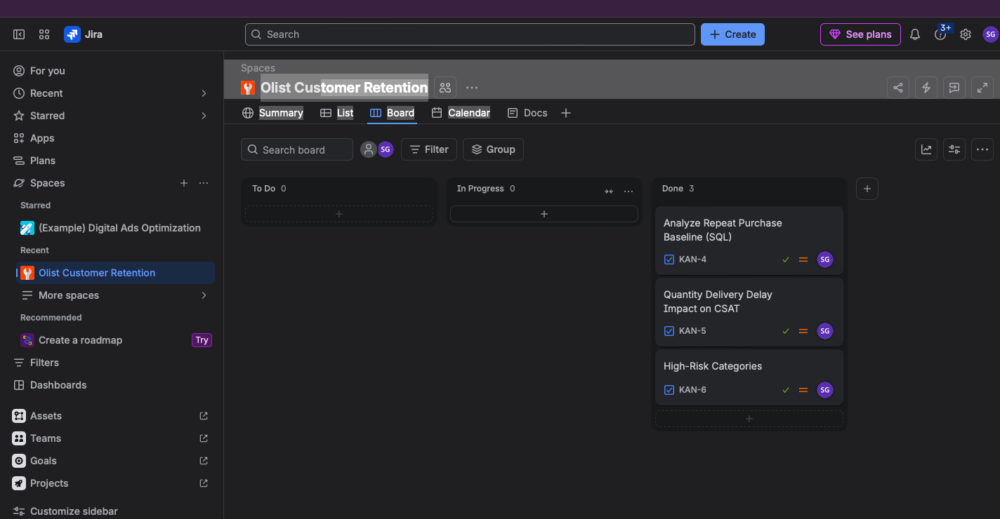

# Olist E-Commerce Retention & Fulfillment Analysis

An end-to-end business analytics project diagnosing fulfillment-driven customer churn across 100k+ orders on Brazil's largest marketplace, Olist. The analysis demonstrates how logistics SLA breaches degrade customer sentiment and proposes an automated, SLA-triggered retention engine.

---

## Executive Summary & Core Findings

* **Retention Baseline:** Unique customer repeat purchase rate is **3.00%** (97.00% single-purchase churn across 93,358 unique delivered customers).
* **Delivery Performance Impact:** Orders delivered late suffer an **8.1x surge** in 1-star reviews (53.69% of late orders receive 1 star vs. 6.63% for on-time orders).
** **Customer Sentiment Collapse:** Overall CSAT plummets from **4.29 / 5.0** on on-time deliveries down to **2.27 / 5.0** when orders breach promised delivery dates.
* **Category Risk:** Bulky freight categories exhibit severe churn risk--**Office Furniture** leads all categories with a **20.37%** negative review share.

---

## Executive Analytics Dashboard

---

## Operational Process Flow: Current vs. Proposed Future State

To mitigate fulfillment-driven churn, the workflow transitions from reactive customer support to an automated, milestone-driven retention safeguard:

---

## Agile Project Delivery (Jira)

Project execution was tracked across four core technical user stories using a Kanban framework:

---

## Technical Stack

* **SQL [SQLite]:** Cohort analysis, repeat purchase computations, and aggregated SLA review metrics.
* **Python [pandas, seaborn, matplotlib]:** Data aggregation, automated executive visual pipelines, and reporting.
* **draw.io:** Current vs. future state operational swimlane process modeling.
* **Atlassian Jira:** Agile delivery management and user story lifecycle tracking.
